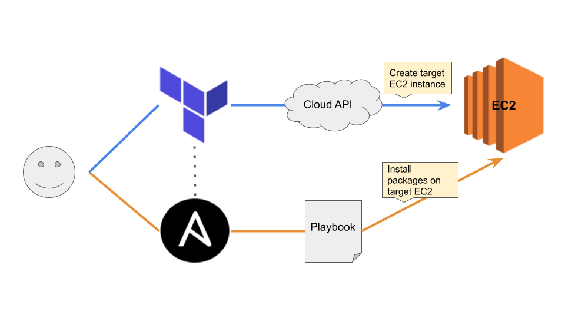
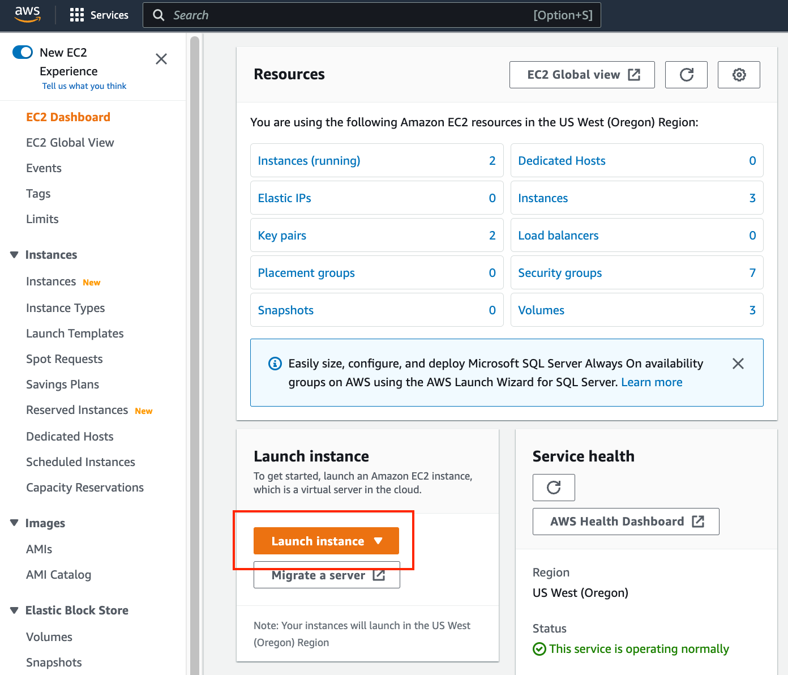
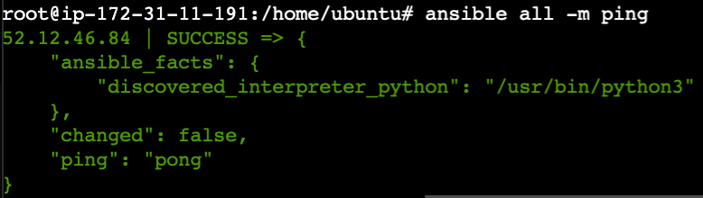
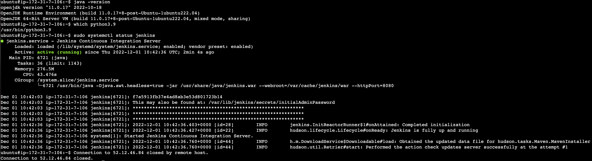

# Automating Infrastructure using Terraform

<p align='center'>
    
</p>

## Project Goal:

The purpose of this exercise is to learn how to deploy, manage, and provision required resources using a configuration file which serves as a blueprint for infrastructure. Using infrastructure provisioning tools such as terraform can save us valuable time required for setup, reduces chances of error, and increases speed of deployment.

**Goals:**

1.  launch an EC2 instance from host server/machine
2.  Connect to the EC2 instance
3.  Install Jenkins, Java, and Python in the instance

**Prerequisites:**

1.  Knowledge of AWS (EC2)
2.  Knowledge of Terraform
3.  Knowledge of Ansible

## Steps

1.  [Setup Host Linux Machine](#Setup-Host-Linux-Machine)
2.  [Installing Terraform on Host Linux Machine](#Installing-Terraform-on-Host-Linux-Machine)
3.  [Installing Ansible and Create Playbooks](#Installing-Ansible-and-Create-Playbooks)
4.  [Start EC2 instance using Terraform](#Start-EC2-instance-using-Terraform)
5.  [Configure target instance using Ansible](#Configure-target-instance-using-Ansible)

### Setup Host Linux Machine

1.  Navigate to AWS <https://us-west-2.console.aws.amazon.com/ec2/home>
2.  Click on "Launch instance"

<p align='center'>
    
</p>

3.  Configure EC2
    1.  **Name:** simplilearn-host-machine
    2.  **Application and OS images (Amazon Machine Image):**
        -   Quick Start: Ubuntu Server 22.04 LTS (HVM), SSD volume type
        -   AMI ID: ami-017fecd1353bcc96e
        -   Architecture: 64-bit (x86)
    3.  **Instance type:** t2.micro
    4.  **Key pair (login):**
        -   Create new keypair
        -   Provide name (ex: simplilearn)
        -   Download pem file
    5.  **Network Settings:** Keep default settings
    6.  **Configure Storage:** Keep default settings
    7.  **Advanced Details:** Skip
    8.  **Review summary:** Click "Launch instance"

4. Connect to the instance.
    1. Once the instance is launched you should be able to see it on the dashboard:
    <https://us-west-2.console.aws.amazon.com/ec2/home?region=us-west-2#InstanceDetails>
    2. Make sure the instance is in its running state. Click on the instance and connect to it.
    3. From the local directory where the pem file is saved from step 3, copy it over to the newly created host server.

```bash
scp -i <pem_key> <pem_key> ubuntu@<ip.address>:/file_path/
```

### Installing Terraform on Host Linux Machine

Source: <https://developer.hashicorp.com/terraform/tutorials/aws-get-started/install-cli>

1.  Ensure system is up-to-date. Install software-properties-common.

```bash
sudo apt-get update && sudo apt-get install -y gnupg software-properties-common
```

2.  Download the signing key

```bash
wget -O- https://apt.releases.hashicorp.com/gpg | \
    gpg --dearmor | \
    sudo tee /usr/share/keyrings/hashicorp-archive-keyring.gpg
```

3.  Verify key fingerprint - should match `E8A0 32E0 94D8 EB4E A189 D270 DA41 8C88 A321 9F7B`

```bash
gpg --no-default-keyring \
    --keyring /usr/share/keyrings/hashicorp-archive-keyring.gpg \
    --fingerprint
```

4.  Add official Hashicorp repository to system

```bash
echo "deb [signed-by=/usr/share/keyrings/hashicorp-archive-keyring.gpg] \
    https://apt.releases.hashicorp.com $(lsb_release -cs) main" | \
    sudo tee /etc/apt/sources.list.d/hashicorp.list
```

5.  Update package `sudo apt update`
6.  Install terraform from the new repository `sudo apt-get install terraform`
7.  Verify Installation `terraform -version`

### Installing Ansible and Create Playbooks

1.  Install Ansible on main control server
    -   Ansible gets installed on a master machine, and the configuration gets pushed to nodes.
    -   There are two main components, Modules and Inventory.
    -   Playbooks define the configuration instructions for nodes, while the inventory is a document that groups the nodes under specific labels.

```bash
sudo apt-get update
sudo apt-add-repository ppa:ansible/ansible
sudo apt-get install ansible
ansible --version  # Check installation
```

2.  Create directory to store Ansible files

```bash
mkdir jenkins && cd jenkins
```

3.  Create install yml file for Java

```bash
sudo vim install_openjdk.yaml
```

```yml
---
- hosts: all
  become: yes
  tasks:  
        # force_pat_get configures it so apt_get is used instead of apt
        # update_cache is the same as running apt-get update
        # Only update cache if it was built 3600s ago
      - name: Update apt repo and cache on all Debian/Ubuntu boxes
        apt: update_cache=yes force_apt_get=yes cache_valid_time=3600
      - name: Install OpenJDK Java
        apt: name=openjdk-11-jdk update_cache=yes cache_valid_time=3600
```

4.  Create install yml file for jenkins

```bash
sudo vim install_jenkins.yaml
```

```yml
---
- hosts: all
  become: yes
  tasks:
      - name: Update apt repo and cache on all Debian/Ubuntu boxes
        apt: update_cache=yes cache_valid_time=3600
      - name: ensure jenkins apt repo key in installed
        apt_key: url=https://pkg.jenkins.io/debian/jenkins.io.key state=present
      - name: ensure jenkins apt repo key in installed
        apt_repository: repo='deb https://pkg.jenkins.io/debian-stable binary/' state=present
      - name: ensure jenkins installed
        apt: name=jenkins update_cache=yes
      - name: ensure jenkins running
        service: name=jenkins state=started
```

5.  Create install yml file for Python

```bash
sudo vim install_python.yaml
```

```yml
---
- hosts: all
  become: yes
  tasks:
      - name: Update local systems repository
        apt: update_cache=yes
      - name: Install Software Properties Common
        apt: name=software-properties-common
      - name: Add apt repository for deadsnakes
        apt_repository: repo=ppa:deadsnakes/ppa update_cache=yes
        # state=present makes it so ansible makes the package available and installed
      - name: Install Python
        apt: name=python3.9 state=present
```

### Start EC2 instance using Terraform

1.  Create project repository on host server

```bash
mkdir terraform && cd terraform
```

2.  Create variables file.
    -   For this we need the AMI (Amazon Machine Image) you are going to use (Ubuntu, CentOS, etc).
    -   To find an AMI, navigate to `Services -> EC2 -> Images -> AMIs -> click on public images -> type Ubuntu`. Currently, the ami specified in the template is for `us-west-2` region.
    -   In the template below, please provide the correct `access_key_value`, `secret_key_value`, and `key_pair_name`

```bash
sudo vim variables.tf
```

```terrafrom
variable "aws_access_key" {
    description = "Access key to AWS console"
    type = string
    default = "<access_key_value>"
}

variable "aws_secret_key" {
    description = "Secret key to AWS console"
    type = string
    default = "<secret_key_value>"
}

variable "instance_name" {
    description = "Name of the instance to be created"
    default = "jenkins-project"
}

variable "instance_type" {
    description = "Name of instance type"
    default = "t2.micro"
}

variable "number_of_instances" {
    description = "number of instances to be created"
    default = 1
}

variable "ami_id" {
    description = "The AMI to use: Canonical, Ubuntu, 22.04 LTS, amd64 jammy image build on 2022-09-12"
    default = "ami-017fecd1353bcc96e"
}

variable "key_pair_name" {
    description = "Name of pem key"
    default = "<key_pair_name>"
}
```

3.  Create config file
    -   Specify the cloud provider to make requests to AWS. Other providers include AWS, Google, Azure, etc.
    -   Specify EC2 instance configuration resource.
    -   Use a local-exec provisioner to run a command on the host machine to save the public ip of the instance created to `/etc/ansible/hosts`.
    -   `/etc/ansible/hosts` is the default storage for managed nodes or "hosts" in a inventory file. Different inventory files can be specified at command line via the argument `-i <path>`.

```bash
sudo vim config.tf
```

```terraform
provider "aws" {
    region = "us-west-2"
    access_key = var.aws_access_key
    secret_key = var.aws_secret_key
}

resource "aws_instance" "jenkins" {
    ami = var.ami_id
    count = var.number_of_instances
    instance_type = var.instance_type
    key_name = var.key_pair_name
    vpc_security_group_ids = [aws_security_group.main.id]
    tags = {
        Name = "jenkins_server"
    }

    provisioner "local-exec" {
        command = "echo ${self.public_ip} >> /etc/ansible/hosts"
    }
}

output "ip" {
    value = "${aws_instance.jenkins.public_ip}"
}
```

4.  Create the security group file. Some concepts to know:
    -   **egress** - outbound traffic/requests (and response)
    -   **ingress** - incoming traffic/requests
    -   **cidr_blocks** - group of addresses that share the same prefix and contain the same number of bits. Supernetting - combination of connecting CIDR blocks into a group that share a common network prefix. The address 0.0.0.0 is a non-routable meta-addresses matching all IPv4 addresses.
    -   **from_port** - start port or ICMP type
    -   **to_port** - end range port
    -   **protocol** - network connection protocol such as "tcp". -1 means all protocols.
    -   **self** - whether the security group itself is added as a source to ingress rule

```bash
sudo vim security.tf
```

```terraform
resource "aws_security_group" "main" {
    name = "terraform-sg"
    egress = [
        {
          cidr_blocks      = ["0.0.0.0/0", ]
          description      = ""
          from_port        = 0
          ipv6_cidr_blocks = []
          prefix_list_ids  = []
          protocol         = "-1"
          security_groups  = []
          self             = false
          to_port          = 0
        }
    ]
    ingress = [
        {
          cidr_blocks      = ["0.0.0.0/0", ]
          description      = ""
          from_port        = 22
          ipv6_cidr_blocks = []
          prefix_list_ids  = []
          protocol         = "tcp"
          security_groups  = []
          self             = false
          to_port          = 22
        }
    ]
}
```

5.  Run init in directory containing config file

```bash
terraform init
```

6.  Validate terraform configuration, then dry-run

```bash
terraform validate
terraform plan
```

7.  Deploy EC2 instance

```bash
sudo terraform apply --auto-approve
```

### Configure target instance using Ansible

1.  Create a ssh key on host instance

```bash
ssh-keygen -t rsa
```

2.  Navigate to `/root/.ssh/` directory and copy the `id_rsa.pub` key
3.  ssh connect into target instance

```bash
ssh -i <pem-key-file> ubuntu@<target_instance_public_ip_address>
```

4. Navigate to the `/root/.ssh/` directory and paste the copied `id_rsa.pub` key into the `authorized_keys` file.
5.  Back in the host server jenkins directory, run the following to check connection

```bash
ansible all -m ping
```

<p align='center'>
        
</p>

6.  Install the required software

```bash
ansible-playbook install_openjdk.yaml
ansible-playbook install_jenkins.yaml
ansible-playbook install_python.yaml
```

7. On the target server, run the following to check installed versions of software

```bash
java -version
python3 --version
sudo systemctl status jenkins
```

<p align='center'>
        
</p>

## Congrats! You have now successfully created an EC2 instance using Terraform, and configured necessary dependencies using Ansible. 
